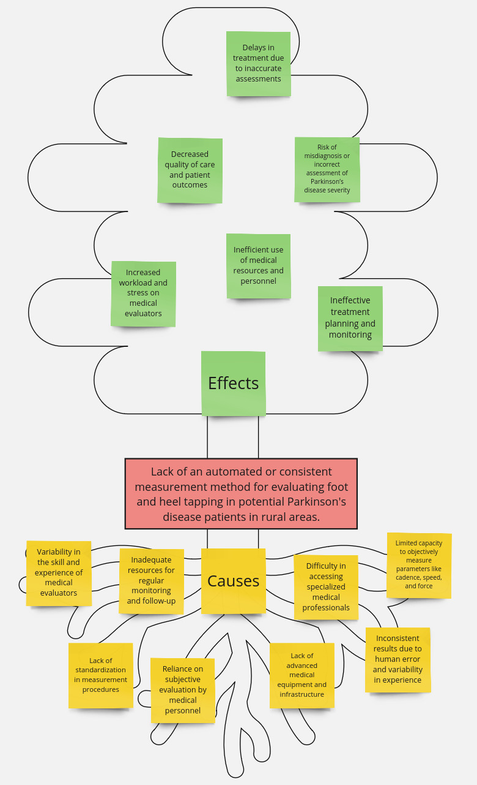

# Problem Tree Diagram

## Core Problem

Lack of an automated or consistent measurement method for evaluating foot and heel tapping in potential Parkinson's disease patients in rural areas.

## Root Causes

### Manual Measurement Challenges

- Reliance on subjective evaluation by medical personnel.
- Inconsistent results due to human error and variability in experience.
- Limited capacity to objectively measure parameters like cadence, speed, and force.

### Limited Access in Rural Areas

- Lack of advanced medical equipment and infrastructure.
- Difficulty in accessing specialized medical professionals.
- Inadequate resources for regular monitoring and follow-up.

### High Variability in Evaluator Experience

- Variability in the skill and experience of medical evaluators.
- Lack of standardization in measurement procedures.

## Effects

### Inaccurate Diagnoses

- Risk of misdiagnosis or incorrect assessment of Parkinson’s disease severity.
- Ineffective treatment planning and monitoring.

### Reduced Patient Outcomes

- Delays in treatment due to inaccurate assessments.
- Decreased quality of care and patient outcomes.

### Inefficient Resource Utilization

- Inefficient use of medical resources and personnel.
- Increased workload and stress on medical evaluators.

